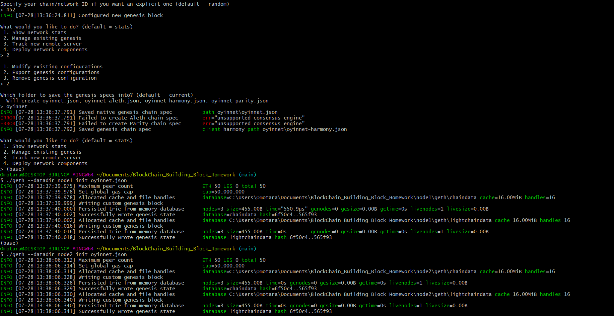

# BlockChain_Building_Block_Homework

The project involves setting up a private testnet that can be used to explore potentials for blockchain at ZBank since there are no real money involved here.
Kindly follow the instructions below on how to use the chain to explore the blockchain technology.

A. Ethereum network setup steps
1.	Download the latest version of geth (I used 1.10.4), unpack the downloaded zipped folder and copy the contents of the folder to a desired working folder
2.	Generate two new nodes with new account addresses that will serve as our pre-approved sealer addresses. Create accounts for two nodes for the network with a separate datadir for each using geth. 

    •	./geth --datadir node1 account new
    
    •	./geth --datadir node2 account new

This will also create a public address key for each node.

3.	Generate the genesis block by the steps shown below:

    •	Run puppeth, name the network (oyinet), and select the option to configure a new genesis block.
   
    •	Choose the Clique (Proof of Authority) consensus algorithm.
   
    •	Paste both account addresses from the first step one at a time into the list of accounts to seal.
  
    •	Paste them again in the list of accounts to pre-fund. There are no block rewards in PoA, so it needs to pre-fund.
  
    •	Complete the rest of the prompts and choose the "Manage existing genesis" option.
  
    •	Export genesis configurations. This will fail to create two of the files, but only taranet.json is needed.
  
    •	The chain ID used is 111. The is required for the chain to operate in general - e.g. it's required when signing transactions, meaning transactions signed on the ETH network end up with a different hash than those signed on ETC. (source: https://ethereum.stackexchange.com/questions/37533/what-is-a-chainid-in-ethereum-how-is-it-different-than-networkid-and-how-is-it#:~:text=Chain%20identifier%20%28chainID%29%20introduced%20in%20EIP-155%20protects%20transaction,processes%20of%20signing%20transactions%20and%20verifying%20transaction%20signatures.)
    
    

4.	Initialize the nodes with the genesis json file by using geth

    •	./geth --datadir node1 init oyinet.json
    
    •	./geth --datadir node2 init oyinet.json
    
     
    
5.	The Nodes can now be used for mining blocks by running the nodes on separate terminal windows:

    •	./geth --datadir node1 --unlock"162f34a2d0262f3e5419a194109f6192e2eb6011" --mine --rpc --allow-insecure-unlock
    
     
    
    • ./geth --datadir node2 --unlock "11bfadbaf976cd2e4a0d2753cee0cbd9f8266e6f" --mine --port 30304 bootnodes"enode://0628e820577b35c77c4e457ee4b7937ff103cd4aa8506a57f215d24bdea9759c2b057166049e379c795317ce6dea6179d08f4708efecbf74fa66c6f2d6ac7e03@127.0.0.1:30303" --ipcdisable --allow-insecure-unlock
    
    
    
6.	The private PoA blockchain should now be running and the blockchain can be added to My Crypyo for testing.

B. SEND A TEST TRANSACTION
1.	Open the MyCrypto app, then click Change Network at the bottom left. Click on Add Custom Node and this will bring a prompt to set up the custom node.

2.	After connecting to the custom network in MyCrypto, it can be tested by sending money between accounts. This can be done by :

    •	Select the View & Send option from the left menu pane, then click Keystore file

    •	On the next screen, click Select Wallet File, then navigate to the keystore directory inside your Node1 directory, select the file located there, provide your password when prompted and then click Unlock

    

    •	This will open your account wallet inside MyCrypto.

    

    •	In the To Address box, type the account address from Node2, then fill in an arbitrary amount of ETH:
    
    
    
    •	Confirm the transaction by clicking "Send Transaction", and the "Send" button in the pop-up window.
    
    
    
    •	Click the Check TX Status when the green message pops up, confirm the logout:
    
    
    
    •	You should see the transaction go from Pending to Successful in around the same blocktime you set in the genesis.
    
    •	You can click the Check TX Status button to update the status
    
    

